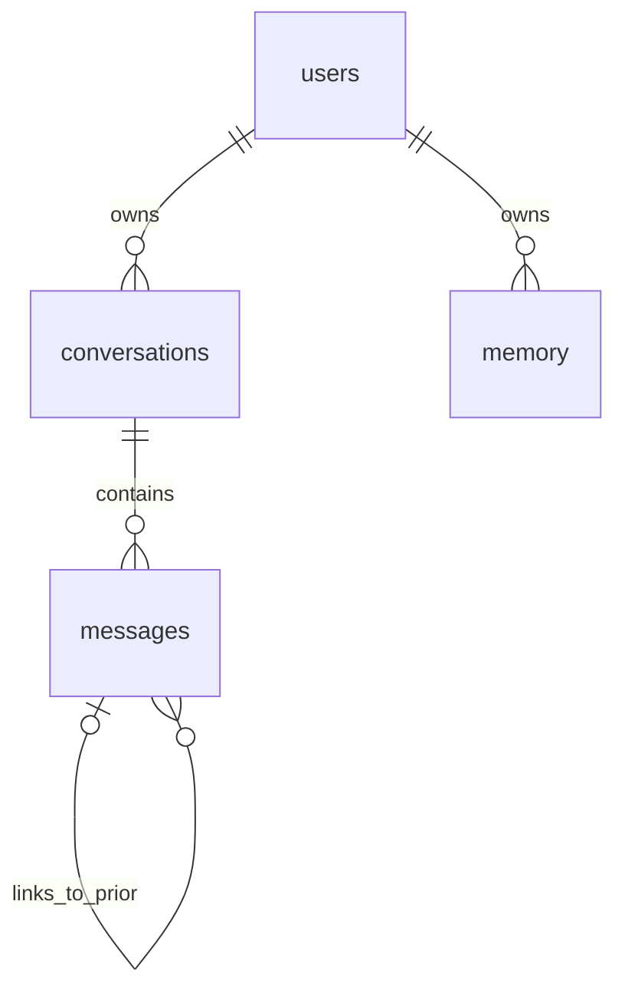

# AI Assistant

FastAPI and React chat app with Gemini, Google sign-in, Neon PostgreSQL, Qdrant Cloud hybrid search, and Tavily web search.

## Setup guide

### Prerequisites

- Python 3.12, [uv](https://docs.astral.sh/uv/), Node.js 18+, and npm
- A Neon PostgreSQL database
- A Google AI Studio API key, Qdrant Cloud cluster and API key, and Tavily API key
- A Google Cloud **Web application** OAuth client ID and client secret

### 1. Configure the services

```bash
cp example.env .env
```

Set `DATABASE_URL`, `GOOGLE_API_KEY`, `TAVILY_API_KEY`, `QDRANT_ENDPOINT`, and `QDRANT_API_KEY` in `.env`. Copy the pooled connection string from the [Neon connection details](https://neon.com/docs/connect/connect-from-any-app), including `sslmode=require`. The backend creates the four application tables in the selected Neon database at startup. The old local database is not copied.

Set `GOOGLE_OAUTH_CLIENT_ID`, `GOOGLE_OAUTH_CLIENT_SECRET`, and a random `SESSION_SECRET`. The existing `CLIENT-ID` and `CLIENT-SECRET` variable names are also accepted. For local development, set:

```env
GOOGLE_OAUTH_REDIRECT_URI=http://localhost:5173/api/auth/callback
FRONTEND_ORIGIN=http://localhost:5173
SESSION_HTTPS_ONLY=false
```

Add **exactly** `http://localhost:5173/api/auth/callback` to the OAuth client's *Authorized redirect URIs* in Google Cloud. For production, use your HTTPS site URL for the origin and callback, and set `SESSION_HTTPS_ONLY=true`. Keep OAuth secrets and `SESSION_SECRET` on the backend only.

### 2. Run the backend

```bash
cd backend
uv sync
cd ..
backend/.venv/bin/python -m uvicorn backend.main:app --host 127.0.0.1 --port 8000 --reload
```

The API is at `http://127.0.0.1:8000/docs`. Startup needs the Neon connection and a Qdrant Cloud collection. Set `QDRANT_COLLECTION_NAME=ai-assistant-collection` and `QDRANT_DENSE_DATATYPE=float32` for the existing collection, or use a new collection name if creating one. Gemini Embedding 2 produces the 3072 dimensional dense vectors; `Qdrant/bm25` supplies sparse vectors. Qdrant fuses the two searches, and BGE reranks the results.

`RERANKER_4BIT=true` loads `BAAI/bge-reranker-v2-m3` with 4 bit NF4 weights. This was verified on CPU. If the installed hardware or libraries cannot run that path, the backend logs a warning and uses the standard precision reranker. Dense embeddings in Qdrant remain `float32` by default; reranker quantization does not change them.
Embedding and reranker models load on first use, so the first document operation or RAG reply can take longer.

### 3. Run the frontend

```bash
cd frontend
npm ci
npm run dev
```

Open `http://localhost:5173`, then sign in with Google. Use this host consistently; opening the app at `127.0.0.1:5173` creates a different browser cookie scope. The side panel shows your conversations, memory, and indexed document count. The Knowledge Base view lets you add, filter, remove, and clear your own sources.

### 4. Add documents and chat

Upload a text, Markdown, or PDF file in **Knowledge Base**. Ingestion writes to Qdrant regardless of the RAG switch. Each completed chat exchange is also indexed in Qdrant after its messages are saved in Neon. Turning RAG off skips retrieval for chat replies; it does not pause or delete indexing. Documents and chat exchanges are filtered by the signed-in user ID. Clearing the Knowledge Base removes uploaded documents while retaining chat exchanges; deleting a conversation removes its indexed exchanges.

For command-line ingestion, supply the user ID returned by `/api/auth/me` while signed in:

```bash
backend/.venv/bin/python ingest.py --user-id YOUR_USER_ID --file docs/sample_knowledge.txt
```

Older Qdrant points indexed under `default_user` are not automatically attached to a Google account; reingest those files after signing in. Web search is independent of the RAG switch. With `TAVILY_API_KEY` configured, the assistant can call `tavily_search` for current information and provide source URLs.

### Agent files and conversation context

Ask the assistant to create, read, list, move, or delete text files and folders. It can work only inside `data/workspaces/<signed-in-user-id>/`; file paths in chat are relative to that folder. Reads are limited to 12,000 characters per call, writes to 262,144 characters, and deletion of a folder requires it to be empty. Existing files require an explicit overwrite. The workspace is stored on the backend host, so mount `data/` on persistent storage when deploying across restarts or multiple servers. These agent files are separate from uploaded Knowledge Base documents and are not automatically indexed in Qdrant.

Neon retains the full text of every chat message. For model calls, the app sends the most recent 12 prior messages and replaces any prior message over 4,000 characters with a short reference. The assistant can use `search_history` to find older messages and `recall_message` to read a specific range of either a user or assistant message. This also works when RAG is off because it reads the current conversation in Neon, not Qdrant. The current user prompt is sent in full; compaction applies when that prompt becomes history on the next turn. The conversation displayed in the UI and stored in Neon is not truncated. Chat messages are currently text-only; this change does not add image attachments.

## Database architecture

Neon stores accounts, conversations, messages, and saved memory. Qdrant Cloud stores document chunks and completed chat exchanges with Gemini Embedding 2 dense and BM25 sparse vectors. The `user-id` payload on each Qdrant point matches `users.id` in Neon; there is no documents table in PostgreSQL. Conversation points include `conversation_id`, `user_message_id`, and `assistant_message_id`; the assistant message ID is the Qdrant point ID so updates can replace the same point. The `kind` payload distinguishes conversations from uploaded documents.



| Table | Main fields | Relationship |
| --- | --- | --- |
| `users` | `id`, unique `google_sub`, `email`, `name`, `picture`, `created_at` | Google `sub` is the stable sign-in identity. |
| `conversations` | `id`, required `user_id`, `title`, `mode`, `created_at` | `user_id` references `users.id`. |
| `messages` | `id`, required `conversation_id`, `role`, `content`, `created_at`, RAG/memory/thinking settings, `linked_message_id` | `conversation_id` references `conversations.id` with cascade delete; `linked_message_id` optionally references an earlier message. |
| `memory` | `id`, required `user_id`, `content`, `created_at` | `user_id` references `users.id`. |

The backend filters every conversation and memory request by the signed-in user. It filters Qdrant retrieval, listing, and deletion by the same user ID. SQLAlchemy models are in `backend/models.py`; `backend/database.py` opens the Neon connection and creates missing tables. Future changes to existing table structure will need a versioned migration.

## Verification

```bash
backend/.venv/bin/python -m unittest discover -s app_tests -p 'test_auth.py'
backend/.venv/bin/python -m unittest discover -s app_tests -p 'test_pipeline.py'
backend/.venv/bin/python -m unittest discover -s app_tests -p 'test_agent_tools.py'
cd frontend && npm run build
```

The tests use an isolated database and mocks. Full sign-in also requires the redirect URI to be configured in Google Cloud and the Neon connection to be available.
